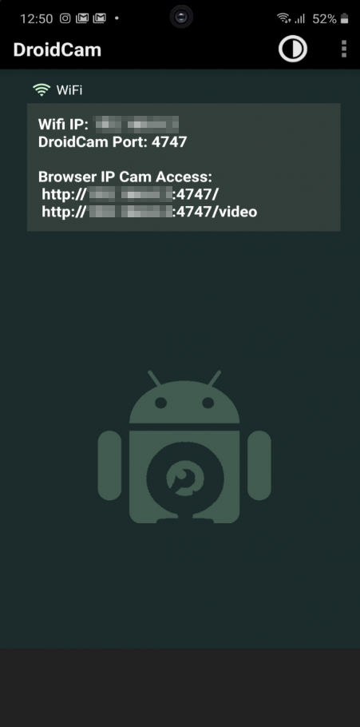
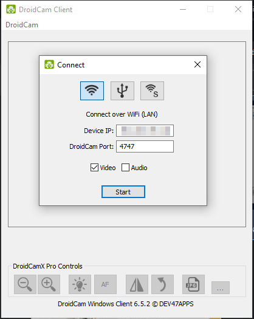

# ROS2 Package: `jekko`

## Overview

The `jekko`  package is a ROS2 package that has been developed by Gizem Erekinci Atlan and Görkem Can Ertemli for the 3rd Semester Prototyping Project of Construction Robotics Masters in RWTH Aachen. It's main purpose is to create and simulate a pick-up skill fo the jekko SPX532 Mini Crane, with the help of a camera device in RVIZ environment.

Original link: https://git.rwth-aachen.de/gorkemcanertemli/ros_groupd_jekko

## Launch File

"launch.py": This launch file is used to start the RVIZ simulation and all of the required Nodes. Since you also require a companion device setup in your own computer and not in the ROS2 environment it doesn't work without the companion app properly.

## Description

The main purpose of this package is to simulate jekko SPX532 machine and control its movements using a camera. In order to make it reach out you also require specified aruco markers so that the algorythm can detect the boundry, detect the location of the material, its height and weight and suggests and simualtes the required movements to pick the specified material automatically if it is possible. The code also considers the height and weight of the object on hand, so even if it can reach it doesn't mean that it can lift it. This package was designed to work with your phone or webcam as your video feed that is provided by the companion app. 


## Requirements

  ### General Requirements
  - Working internet connection
  - Working ROS2 environment
  - Working Python3

  - DroidCam Client in your personal computer. (This is required to use your phone as a webcam, otherwise it is optional, but you might need to change the comapnion app to fit your requirement)
    - Windows: https://dev47apps.com/droidcam/windows/ 
    - Linux: https://www.dev47apps.com/droidcam/linux/

  - DroidCam for your phone to act as a webcam. (This is required to use your phone as a webcam, otherwise it is optional, but you might need to change the comapnion app to fit your requirement)
    - Android: https://play.google.com/store/apps/details?id=com.dev47apps.droidcam 
    - IOS: https://apps.apple.com/us/app/droidcam-webcam-obs-camera/id1510258102

  ### Python Libraries:
  - opencv-python
  - filterpy
  - paho-mqtt
  - numpy
  - pandas
  - base64py
  - zlib
  - math
  - threading
  - queue
  - pathlib
  

## Usage

To install, setup and use the package please follow the following steps:

### Installation of the Package in ROS2 Environment

1. Clone this repository into the src folder of your workspace (Ensure SSH key is set up for GitLab access in the Docker container)

   ```shell
   cd ~/ros2_ws/src
   git clone git@git.rwth-aachen.de:gorkemcanertemli/ros_groupd_jekko.git

2. Build your ROS2 workspace to compile the package:

    ```shell
    cd ~/ros2_ws
    colcon build

### Camera Installation in PC

3. Get yourself the DroidCam Client from here:

  - Windows: https://dev47apps.com/droidcam/windows/
  - Linux: https://www.dev47apps.com/droidcam/linux/

4. Get your phone the DroidCam from here:

  - Android: https://play.google.com/store/apps/details?id=com.dev47apps.droidcam
  - IOS: https://apps.apple.com/us/app/droidcam-webcam-obs-camera/id1510258102

5. After installation of the app and the client make sure that both devices are connected to the same network and run both of the programs.

6. The phone app will show you this screen. Here you need to copy the "Wifi IP" to the specified field in the following step.

  

7. The client will look like this. Here you need to write the ip address that has been provided to you in the DroidCam phone app to the "Device IP".

  

8. Install the package to your computer by typing the following command in the destination folder of your choice. (Make sure that you have SSH already setup)

    ```shell
    git clone git@git.rwth-aachen.de:gorkemcanertemli/ros_groupd_jekko.git

9. From downloaded files we need "camera_setup" folder. This is where we can locate our camera comapanion app "camera_feeder.py", camera calibration script "camera_callibration.py" as well as our camera feed faker "camera_feed_faker.py". The camera_feeder is the main file that we use for sending MQTT feed of our setup AdnroidCam. The camera_calibration script is for the first time setup. It generates the required "mean_camera_matrix.txt" and "mean_distortion_coefficients.txt" files. These are required to be generated so that the camera is undistorted correctly. And finally we have provided a camera_feed_faker, which gives a picture as a "trial" MQTT feed so that the code can be tested even if the camera has not been set up.

10. Please print out the "Checkerboard-A4-30mm-8x6.pdf" from printables folder in 100% settings to a A4 paper as well as provided 3 AruCo papers for later on. The chessboard/checkerboard will be used to calibrate the camera whereas the other aruco papers will be used for the simulation. The aruco files can be found in the "trial_arucos" folder. 

11. Here we need to open the camera_callibration file and run it while using the AndroidCam client and phone app. If everything goes well the feed will be visible through the script's vieewer. Once everything ready please press "spacebar". This will initiate the calibration script and it will start taking required calibration pictures (100 of them) once it can see the printed chessboard printable we provided. Once done the two text files will be generated in the camera_calibration folder. Please transfer them to your own ROS2 environment to be used later.


### Installation of the Package in ROS2 Environment after Camera Installation

12. Once you have transfered the "mean_camera_matrix.txt" and "mean_distortion_coefficients.txt" files, copy them to the package's "\jekko\camera_settings" folder.

13. Now everything should be ready to go.


### Running the Simulation

1. Make sure that you have one of the PDFs in the "printables" folder printed out if you are using your own camera set up. These printables will be read by the camera and the program will be moving accordingly. "trial_aruco101.pdf" is depicting 110kg 1m tall object location, "trial_aruco103.pdf" is representing 110kg 3m tall object. And finally "trial_aruco241.pdf" is for a 250kg 1m tall material.

2. Go and run either the camera_feeder in your PC or camera_feed_faker if you don't want to calibrate and install your own phone as a webcam.

3. This will start the feed to MQTT. If you are using your own phone as a webcam please put it in a location where it can see the printed aruco paper's all sides.

4. Once the camera is set in a place please go to your ROS2 environment and write the following command to launch all of the nodes and necessary files at once in the ROS2 terminal:
    
    ```shell
    source install/setup.bash
    ros2 launch jekko launch.py

5. If everything went right. RVIZ, and camera feed viewer will start working in a bit and once they start their communication there will be a movement to the location of the material in the RVIZ.

### Installed but Jekko package cannot be found

1. If this happens please check if you have all of the requirements installed and working.

2. And follow these if possible:
    
    ```shell
    cd ~/ros2_ws/install/jekko
    source ./local_setup.bash
    

3. If it gives this error:

    ```shell
    bash: ./local_setup.bash: No such file or directory

4. Please follow this solution:

    ```shell
    export AMENT_PREFIX_PATH="/home/ubuntu/ros2_ws/install/jekko:$AMENT_PREFIX_PATH"
    ros2 pkg list | grep jekko

5. If the package `jekko` is listed, then it should be successfully activated. You should be able to launch the package using the command `ros2 launch jekko launch.py`.


### Controls

The Controls of the machinery are designated by the camera setup and according to the printed out aruco markers.


### ROS2 Dependencies

The `jekko` package depends on the following ROS2 packages:

- `robot_state_publisher`: Used to publish the robot's state, which includes the transformation between different joints and links.
- `rviz2`: Used to publish the simulate the machinery.

### Additional Notes

Make sure you have the necessary hardware and software ready to run the codes. Without setting up a proper camera or using the provided camera feed faker the program won't run properly.
For visualization, RVIZ2 is used to display the robot's movement and configuration. Ensure that RVIZ2 is correctly installed and set up in your ROS2 environment.
